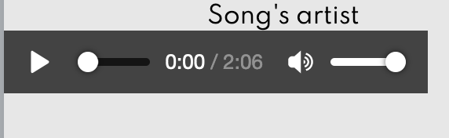
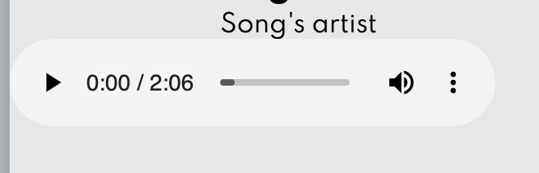

# Music Player


A simple personalised music player built using CSS, HTML and JS. It currently offers 4 songs from soundcloud. The user is able to control the progress of the song, pause, play or skip to the previous / next song. 


---

## Goals

- Use of `object-fit` to center the image from the cover #css
- `user-select: none` prevents the control icons to be selected like normal letters  #css
- `currentTime` event property to populate the current time of the song (to the left)
- `duration` event property to populate the total length of the song (to the right)
- `clientWidth` event property to calculate the total width of the progress bar
- `offsetX` event property to calculate the X offset of the progress bar when we click on it so that we can calculate later at which second to play the song.
- `ended` event to automatically play the next song

---

## FEATURES

1. There are 4 songs that display different artist, song name and cover apart from the song being played
2. The user can control the music (play, pause, next song or previous song)
3. The user can also control the progress bar of the song


---

## Development

### HTML Structure

```html
<div class="player-container">
  <!-- Song -->
  <div class="img-container">
    
  </div>
  <h2 id="title">Song's title</h2>
  <h3 id="artist">Song's artist</h3>
  <audio src="music/jacinto-1.mp3"></audio>
  <!-- Progress -->
  <div class="progress-container" id="progress-container">
    <div class="progress" id="progress"></div>
    <div class="duration-wrapper">
      <span id="current-time">0:00</span>
      <spain id="duration">2:06</spain>
    </div>
  </div>
</div>
```

Since we want the controls of the music player to be personalised we create extra divs bellow the `<audio>` element that we will style in the css file. This way we avoid having the default controls:

| Mozilla                                                 | Chrome                                                  |
| ------------------------------------------------------- | ------------------------------------------------------- |
|  |  |

---

### Controlling the music

For this we use JS and make use of the HTML Audio methods `play()` and  `pause()`. 

For the case of next and previous song we manipulate both the image, the track information on screen (artist and title) and the audio source by creating a `music` object:

```js
// Music Songs
const songs = [
  {
    name: 'song-1',
    displayName: 'Inner Peace',
    artist: 'Mike Chino',
  },
  {
    name: 'song-2',
    displayName: 'Last Summer',
    artist: 'Ikson',
  },
  {
    name: 'song-3',
    displayName: 'Swing',
    artist: 'Peyruis',
  },
  {
    name: 'song-4',
    displayName: 'Wonderland',
    artist: 'Scandinavianz',
  },
];
```

---

### Controlling the progress bar

We use the `timeUpdate`, `currentTime` and `duration` events to update the values of the song's current time and set the progress bar's width accordingly.

We also use the `clientWidth` and `offsetX` properties of the event that is clicking on the bar. This way we can control at which point of time to play the song when clicking on any part of the progress bar.


---

*All images used created by: https://unsplash.com/@dylanleagh* 

*All songs used from soundcloud royalty free music* 